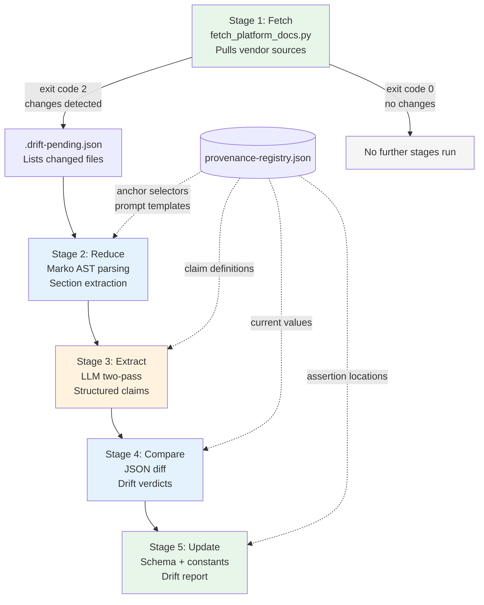
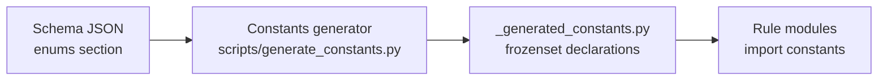
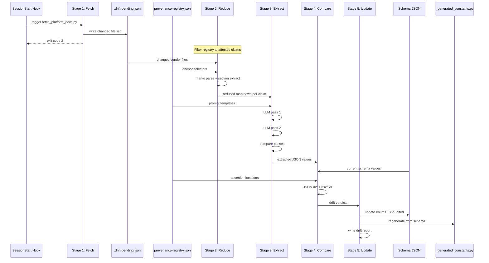

# Design: Rule Provenance Registry

## 1. Problem Statement

skilllint validates plugin files against rules (FM001-FM009, HK001-HK005, AS001-AS008, PA001). Many of these rules assert constraints derived from upstream vendor documentation -- event type enumerations, hook type sets, field constraints, naming rules. These constraints are currently hardcoded as Python literals disconnected from their upstream sources.

This disconnection causes staleness. Concrete examples from the provenance audit:

- **HK002 `VALID_EVENT_TYPES`**: The hardcoded frozenset contains 21 event names. Vendor documentation in `.claude/vendor/` only lists 9 of them. The remaining 12 (PermissionRequest, PostToolUseFailure, StopFailure, TeammateIdle, TaskCompleted, InstructionsLoaded, ConfigChange, WorktreeCreate, WorktreeRemove, PostCompact, Elicitation, ElicitationResult) exist only in the hardcoded constant with no traceable vendor source.

- **HK003 `VALID_HOOK_TYPES`**: The hardcoded frozenset `{"command", "http", "prompt", "agent"}` has no vendor source defining this enumeration. Vendor hook files use `"command"` and `"http"` but no file enumerates the complete valid set.

- **FM007 tool field names**: The set `{"tools", "disallowedTools", "allowed-tools"}` is hardcoded. `disallowedTools` does not appear in any schema file.

- **AS001 naming constraints**: `_MAX_NAME_LENGTH = 64` is backed by schema JSON (`maxLength: 64` in four schema files), but the regex pattern and consecutive-hyphen rule have no vendor source.

When vendor documentation changes (events added, fields renamed, types expanded), there is no mechanism to detect the drift or propagate updates. The fix is manual: someone notices a false positive/negative, traces it to a stale constant, and updates the code.

### Goal

Create a provenance chain: **Rule -> Claim -> Authority -> Extraction -> Comparison -> Update**, so staleness is mechanically detectable and fixable. Every checkable assertion traces to a vendor source. Every vendor source change triggers a comparison. Additions auto-apply; removals require human approval.

## 2. Pipeline Architecture

The system is a 5-stage pipeline. Stages 2-5 run only when Stage 1 detects vendor doc changes. No change = no LLM cost.



### Stage 1: Fetch (exists)

- **Script**: `scripts/fetch_platform_docs.py`
- **Trigger**: SessionStart hook via `.claude/hooks/vendor-drift-check.cjs`
- **Input**: Remote vendor documentation URLs
- **Output**: Raw markdown files in `.claude/vendor/`, `.drift-pending.json` listing changed files
- **Signal**: Exit code 0 = no changes, exit code 2 = changes detected (triggers stages 2-5)

### Stage 2: Reduce (new, mechanical, no LLM)

- **Input**: Changed vendor markdown files (from `.drift-pending.json`) + registry anchor selectors
- **Process**:
  1. Load `provenance-registry.json`, filter to claims whose `authority.vendor_file` matches a changed file
  2. For each affected claim, parse the vendor file with marko (GFM+TOC extensions)
  3. Use the claim's `anchor_selector` to locate the target heading in the AST
  4. Extract the subtree: heading + all content until the next same-or-higher-level heading
  5. Render extracted subtree back to markdown via `MarkdownRenderer`
- **Output**: Reduced markdown per claim (target: section-sized excerpts instead of full documents)
- **Fallback**: If anchor selector does not match any heading, pass full document with a warning flag in the output

### Stage 3: Extract (new, LLM)

- **Input**: Reduced markdown sections from Stage 2 + extraction prompt templates from registry
- **Process**:
  1. For each affected claim, fill the `extraction_prompt` template with the reduced markdown
  2. Run extraction twice (two independent LLM calls)
  3. Compare results: accept only when both passes produce identical structured output
  4. Mismatches between passes flagged for human review (written to drift report, not auto-applied)
- **Output**: Structured JSON per claim (e.g., `{"valid_event_types": ["SessionStart", "PreToolUse", ...]}`)

### Stage 4: Compare (new, mechanical, no LLM)

- **Input**: Extracted claims from Stage 3 + current schema JSON + current rule constants
- **Process**:
  1. For each claim, load the current value from the location specified in `assertion_location`
  2. Compute JSON diff against extracted value
  3. Classify each difference:
     - **MATCH**: No change
     - **ADDED**: New items in extracted set not in current (low-risk)
     - **REMOVED**: Items in current not in extracted set (high-risk)
     - **CHANGED**: Value modification (risk depends on type)
- **Output**: Drift report with per-claim verdicts and risk classifications

### Stage 5: Update (new, mechanical + LLM for constants)

- **Input**: Drift report from Stage 4 + schema files + constants files
- **Process**:
  1. **Schema-backed claims**: Update schema JSON fields, following `refresh_schemas.py` version-bump pattern
  2. **Enum value sets**: Update the enum section in schema JSON, regenerate constants file (same pattern as `_spec_constants.py` generation from `fetch_spec_schema.py`)
  3. **x-audited markers**: Auto-update `x-audited.date` and `x-audited.source` on verified claims
  4. **Risk tiering**:
     - Additions (new event types, new fields): auto-applied
     - Removals (deleted events, removed fields): written to drift report for human approval, not auto-applied
- **Output**: Updated schema files, updated generated constants, drift report

## 3. Registry Schema

The provenance registry is a single JSON file: `packages/skilllint/schemas/provenance-registry.json`.

Each entry maps a **claim** (a specific assertion made by a rule) to its authority source, extraction configuration, and assertion location.

### Top-level structure

```json
{
  "$schema": "https://json-schema.org/draft/2020-12/schema",
  "description": "Rule Provenance Registry -- maps lint rule claims to upstream authority sources",
  "version": "1",
  "claims": {
    "<claim_id>": { ... }
  }
}
```

### Claim ID format

`<rule_code>.<claim_name>` -- e.g., `HK002.valid_event_types`, `AS001.max_name_length`, `FM007.tool_field_names`.

### Claim entry schema

```json
{
  "rule_code": "string -- the rule that uses this claim (e.g., HK002)",
  "claim_name": "string -- what this claim asserts (e.g., valid_event_types)",
  "description": "string -- human-readable description of the claim",
  "claim_type": "enum_set | scalar | pattern | field_set",

  "authority": {
    "vendor_file": "string -- path relative to repo root (e.g., .claude/vendor/claude_code/plugins/plugin-dev/skills/hook-development/SKILL.md)",
    "anchor_selector": "string | null -- URL-fragment-style anchor (e.g., #hook-input-and-output). null if claim spans the whole document",
    "authority_url": "string | null -- canonical external URL if available"
  },

  "extraction": {
    "prompt_template": "string -- Jinja-style template for LLM extraction. {{section}} is replaced with reduced markdown",
    "output_schema": {
      "type": "string -- JSON Schema type for the extracted value (array, object, string, integer)"
    },
    "post_processing": "string | null -- optional transformation (e.g., lowercase, sort, unique)"
  },

  "assertion_location": {
    "file": "string -- path to the file holding the current value",
    "symbol": "string -- Python symbol name or JSON path (e.g., VALID_EVENT_TYPES, $.properties.name.maxLength)",
    "source_type": "python_constant | schema_json_field | schema_json_enum"
  },

  "x-audited": {
    "date": "string -- ISO 8601 date of last successful verification",
    "source": "string -- vendor file path used in last verification"
  }
}
```

### Concrete claim entry examples

See [companion: registry-schema-examples.md](./registry-schema-examples.md) for full JSON examples of each claim type (enum_set, scalar, pattern, field_set) using real rule data from the provenance audit.

## 4. Opinion Catalog Schema

Rules with no upstream authority -- pure lint-style opinions -- go in a separate catalog: `packages/skilllint/schemas/opinion-catalog.json`. These rules are not drift-checkable because there is no vendor source to compare against.

### Structure

```json
{
  "description": "Lint-opinion rules with no upstream authority source",
  "version": "1",
  "opinions": {
    "<rule_code>": {
      "rule_code": "string",
      "description": "string -- what the rule enforces",
      "rationale": "string -- why this is a lint opinion rather than a spec requirement",
      "constraint": "string -- the specific check (e.g., regex pattern, field check)",
      "references": ["string -- any supporting context, not authoritative"]
    }
  }
}
```

### Rules classified as opinions (from provenance audit)

| Rule | What it checks | Why it is an opinion |
|------|---------------|---------------------|
| FM004 | Multiline YAML syntax in description field | No vendor schema restricts multiline syntax. Claude Code runtime accepts it. This is a style preference. |
| AS007 | Wildcard patterns in tools field | No schema or vendor doc defines wildcard validation. This is a safety recommendation. |

### Rules with partial provenance

Some rules have partial upstream backing. These go in the provenance registry for the backed claims and the opinion catalog for the unbacked portions:

| Rule | Backed claim | Unbacked claim |
|------|-------------|---------------|
| AS001 | `max_name_length = 64` (schema-backed) | Regex pattern `^[a-z0-9]([a-z0-9-]*[a-z0-9])?$` and consecutive-hyphen rule (no vendor source) |
| FM007 | `allowed-tools` type = string (agentskills_io schema) | `disallowedTools` field name (not in any schema) |

## 5. Marko Integration

Stage 2 (Reduce) uses marko with GFM+TOC extensions for mechanical section extraction from vendor markdown files.

### Parser configuration

```python
from marko import Markdown
from marko.md_renderer import MarkdownRenderer

# Parsing instance: GFM for tables, TOC for slug generation
parser = Markdown(extensions=['gfm', 'toc'])

# Rendering instance: serialize subtrees back to markdown
renderer = Markdown(extensions=['gfm'], renderer=MarkdownRenderer)
```

### Anchor matching

Registry claim entries use URL-fragment-style anchors (e.g., `#hook-input-and-output`). The reduction stage:

1. Parses the vendor markdown into an AST via `parser.parse(text)`
2. Walks the AST for `Heading` and `SetextHeading` nodes
3. Extracts heading text, generates a slug using `marko.ext.toc`'s slugify function (or the fallback: strip non-word chars, lowercase, replace spaces with hyphens)
4. Compares generated slug against the anchor selector (without the `#` prefix)
5. On match: captures the heading and all following elements until the next heading at the same or higher level

### Section extraction

Given a matched heading at level N, the extracted subtree includes:
- The heading itself
- All block elements following it until encountering a heading at level <= N
- This captures paragraphs, tables, code blocks, lists, and nested headings at deeper levels

### Table extraction

For claims backed by vendor markdown tables (e.g., field constraint definitions), the reduction stage preserves `Table` elements from the GFM extension. Stage 3 receives the table as rendered markdown, which the LLM can parse in its prompt.

For mechanical (non-LLM) table extraction, the pipeline can walk the AST directly:
- `Table.head` property returns the header `TableRow`
- `Table.children[1:]` returns data rows
- Each `TableCell` has `inline_body` (raw text) and `align` attributes

### Code block extraction

For claims backed by code examples in vendor docs (e.g., JSON schema snippets), `FencedCode` elements are preserved in the extracted subtree. The `lang` attribute enables filtering by language (e.g., extract only `json` blocks).

### Fallback behavior

If the anchor selector does not match any heading slug in the parsed document:
1. The full document is passed to Stage 3 instead of a section
2. A warning is emitted in the stage output: `{"claim_id": "...", "selector_failed": true, "fallback": "full_document"}`
3. This warning appears in the drift report so the selector can be updated

Selector failures are expected when vendor docs are reorganized (headings renamed, sections moved). The fallback ensures extraction still runs, at the cost of more LLM input tokens.

## 6. Generated Constants

Enum value sets flow from schema JSON to Python constants through a generation pipeline.

### Current pattern

`scripts/fetch_spec_schema.py` fetches the agentskills.io specification, produces `packages/skilllint/schemas/agentskills_io/v1.json`, and generates `packages/skilllint/_spec_constants.py` with typed Python constants derived from the schema.

### Extended pattern

The provenance registry introduces additional enum value sets that need the same treatment:

| Claim | Schema location | Generated constant |
|-------|----------------|-------------------|
| HK002.valid_event_types | `claude_code/v1.json` `$.enums.valid_event_types` | `VALID_EVENT_TYPES: frozenset[str]` |
| HK003.valid_hook_types | `claude_code/v1.json` `$.enums.valid_hook_types` | `VALID_HOOK_TYPES: frozenset[str]` |
| FM007.tool_field_names | `claude_code/v1.json` `$.enums.tool_field_names` | `TOOL_FIELD_NAMES: frozenset[str]` |

### Schema extension for enums

Provider schema JSON files gain an `enums` section alongside the existing `file_types` and `provenance` sections:

```json
{
  "provenance": { ... },
  "enums": {
    "valid_event_types": {
      "description": "Recognized hook event type names",
      "values": ["SessionStart", "UserPromptSubmit", "PreToolUse", ...],
      "x-audited": {
        "date": "2026-03-23",
        "source": ".claude/vendor/claude_code/plugins/plugin-dev/skills/hook-development/SKILL.md"
      }
    },
    "valid_hook_types": {
      "description": "Recognized hook type values",
      "values": ["command", "http", "prompt", "agent"],
      "x-audited": {
        "date": "2026-03-23",
        "source": ".claude/vendor/claude_code/plugins/plugin-dev/skills/hook-development/SKILL.md"
      }
    }
  },
  "file_types": { ... }
}
```

### Generation flow



The generator reads `enums` sections from all provider schema files and produces a single `_generated_constants.py` with typed `frozenset` declarations. Rule modules import from this file instead of hardcoding values.

## 7. Risk Classification

### Tiering rules

| Change type | Risk | Action |
|-------------|------|--------|
| New item added to an enum set | Low | Auto-apply: add to schema enum, regenerate constants |
| New field added to a field set | Low | Auto-apply: add to schema, regenerate constants |
| Scalar value increased (e.g., maxLength 64 -> 128) | Low | Auto-apply: update schema value |
| Item removed from an enum set | High | Flag for human review: removal may break existing plugins |
| Field removed from a field set | High | Flag for human review |
| Scalar value decreased (e.g., maxLength 64 -> 32) | High | Flag for human review: tighter constraint may cause new violations |
| Pattern changed (e.g., regex for name validation) | High | Flag for human review |

### Human review output

High-risk changes produce an entry in the drift report:

```json
{
  "claim_id": "HK002.valid_event_types",
  "change_type": "REMOVED",
  "current_values": ["SessionStart", "Stop", "Notification", ...],
  "extracted_values": ["SessionStart", "Stop", ...],
  "removed": ["Notification"],
  "risk": "high",
  "action": "requires_human_approval",
  "vendor_source": ".claude/vendor/claude_code/plugins/plugin-dev/skills/hook-development/SKILL.md",
  "extraction_date": "2026-03-23"
}
```

## 8. Integration with Existing System

### fetch_platform_docs.py

No changes to the script itself. The pipeline depends on its existing behavior:
- Writes updated vendor files to `.claude/vendor/`
- Writes `.drift-pending.json` listing changed files
- Returns exit code 2 when changes are detected

The SessionStart hook (`vendor-drift-check.cjs`) already triggers this script. Stages 2-5 are triggered by the same hook when exit code 2 is returned, or by a separate orchestration script that checks for `.drift-pending.json`.

### .drift-pending.json

Existing format (list of changed file paths). Stages 2-5 read this file to determine which vendor files changed, then filter the registry to claims affected by those files.

### x-audited markers

Existing schema files already have `x-audited.date` and `x-audited.source` on fields. The pipeline extends this to enum entries in the new `enums` section. Stage 5 auto-updates these markers when a claim is verified:
- `x-audited.date` is set to the current date
- `x-audited.source` is set to the vendor file path used for verification

### _spec_constants.py

The existing `_spec_constants.py` (generated by `fetch_spec_schema.py` for agentskills.io fields) continues to exist. The new `_generated_constants.py` covers enum value sets from all providers. Rule modules that currently hardcode constants migrate their imports to `_generated_constants.py`.

### refresh_schemas.py

The existing version-bump script continues to work on schema files. Stage 5 follows the same pattern (read current version, write updated version) but modifies field values rather than just bumping version numbers.

## 9. File Layout

### New files

```
packages/skilllint/schemas/
    provenance-registry.json          # Central claim registry
    opinion-catalog.json              # Unsourced lint-opinion rules

packages/skilllint/
    _generated_constants.py           # Auto-generated from schema enums

scripts/
    reduce_vendor_sections.py         # Stage 2: marko-based section extraction
    extract_claims.py                 # Stage 3: LLM two-pass extraction
    compare_claims.py                 # Stage 4: JSON diff + risk classification
    update_claims.py                  # Stage 5: schema + constants update
    generate_constants.py             # Enum-to-Python generator
```

### Modified files

```
packages/skilllint/schemas/claude_code/v1.json   # Add enums section
packages/skilllint/schemas/agentskills_io/v1.json # Add enums section (if applicable)
packages/skilllint/rules/as_series.py             # Import from _generated_constants
packages/skilllint/plugin_validator.py            # Import from _generated_constants
                                                  # (VALID_EVENT_TYPES, VALID_HOOK_TYPES,
                                                  #  tool field names)
```

### Unchanged files

```
scripts/fetch_platform_docs.py       # Stage 1 -- already exists, no modifications
scripts/fetch_spec_schema.py         # Continues generating agentskills_io schema + _spec_constants
scripts/refresh_schemas.py           # Continues version-bumping schemas
.claude/hooks/vendor-drift-check.cjs # Continues triggering fetch on SessionStart
```

## 10. Data Flow Summary


